# cowin_vaccine_slot_notification

An android app to provide its users details regarding the availability of Covid-19 vaccine in India.

## Background

Given application is made as a part of Btech 6th semester internship under the guidance of Dr. Garima Chhikara mam.

## Tools

* Flutter
* Firebase
* Google Colab
* Azure Web Services
* Co-Win API

## Features

### Authentication

#### Login
 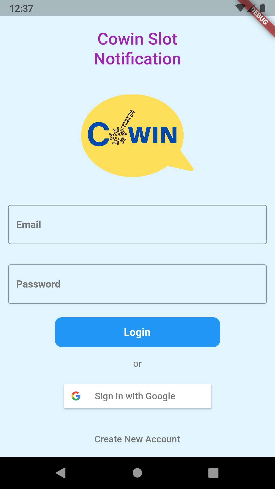 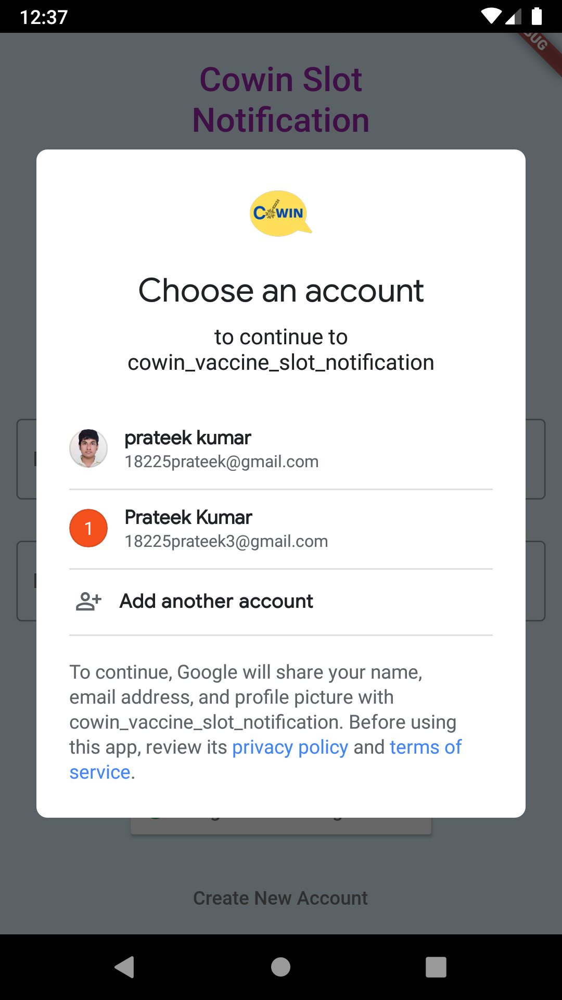

#### Register
 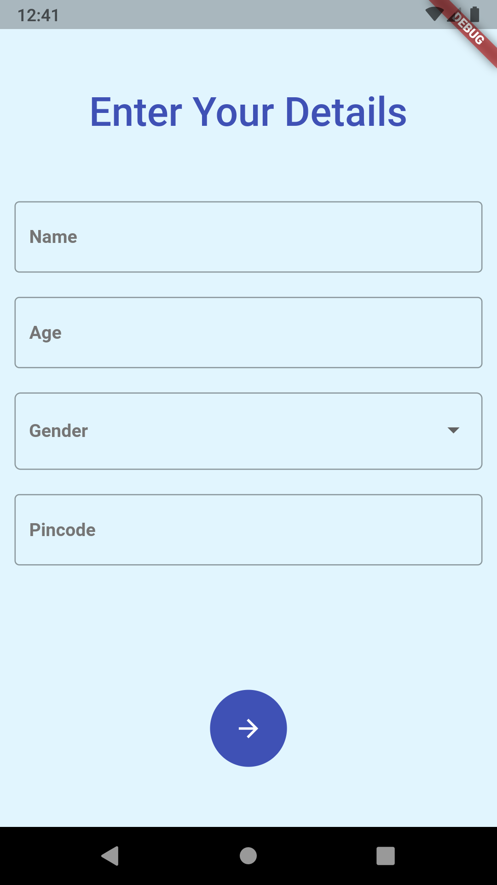 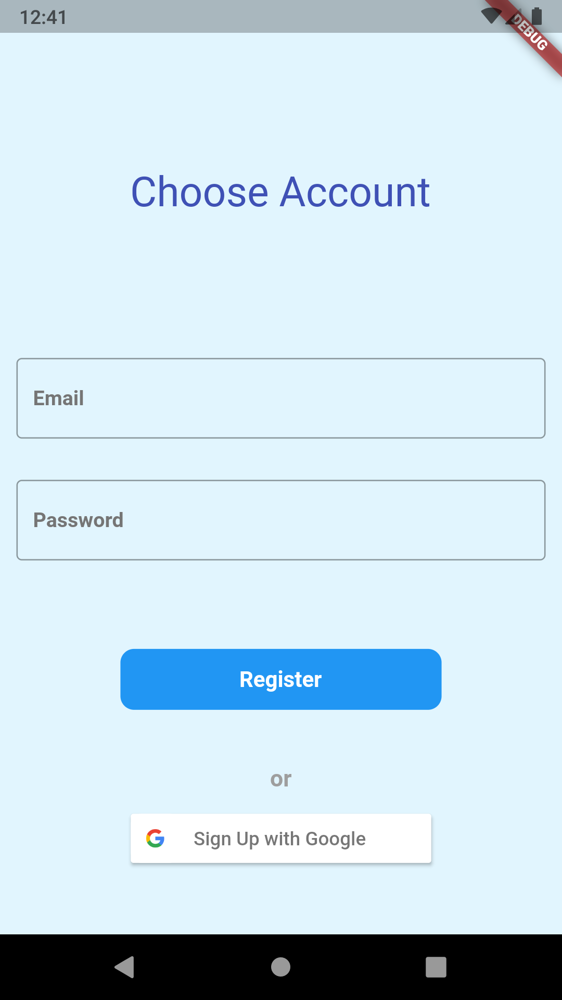

### Manage Details
 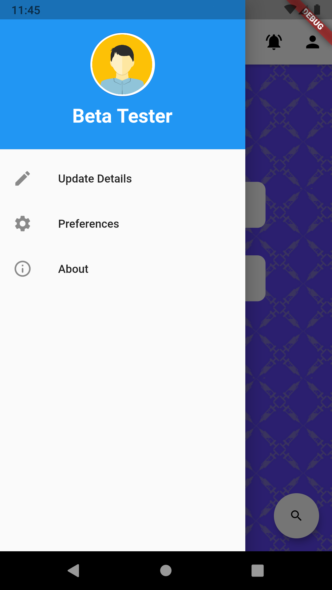 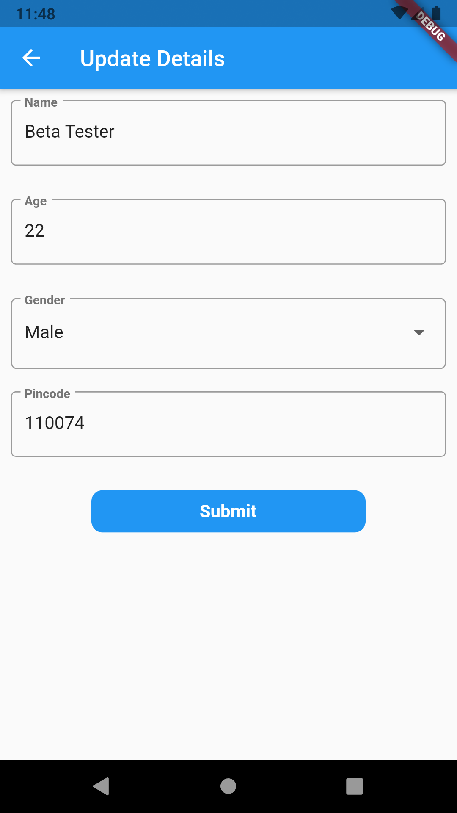 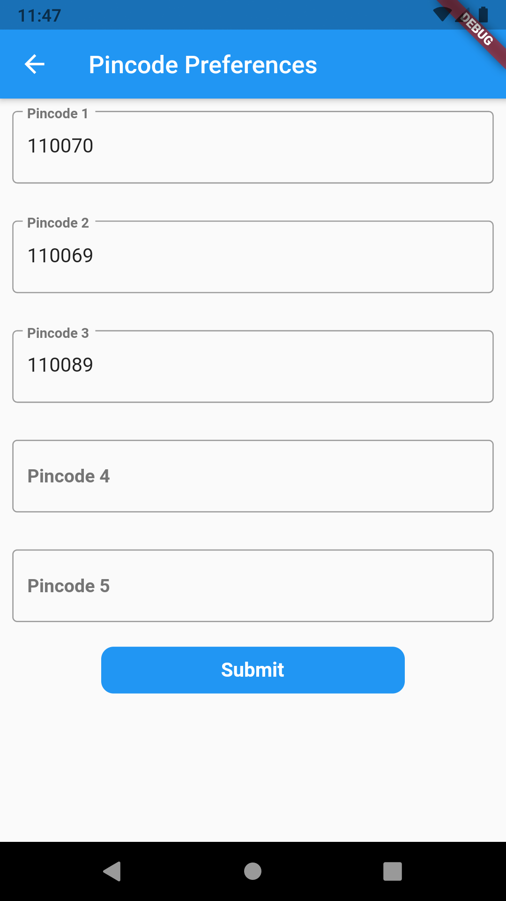

### Vaccine Schedule and Summary
 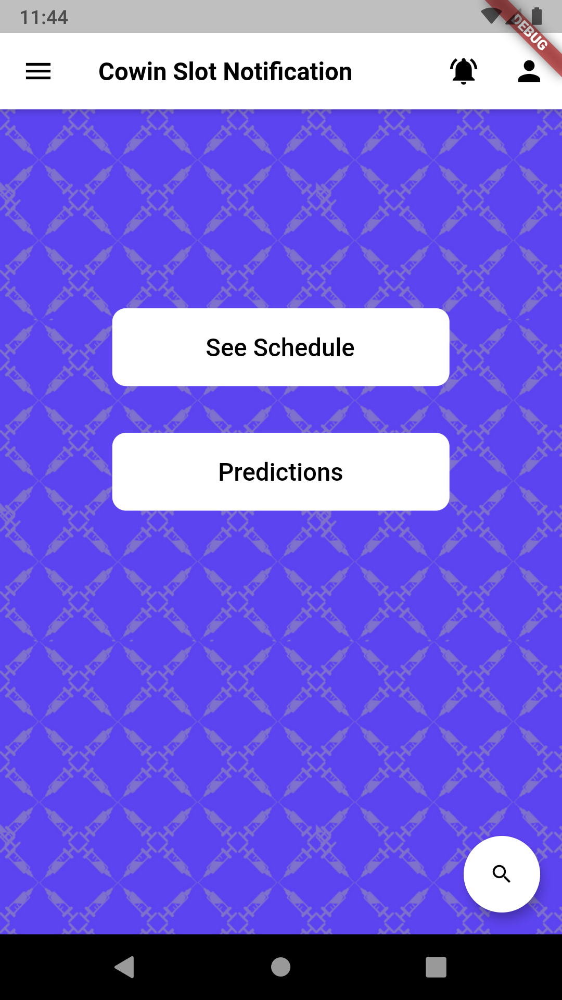 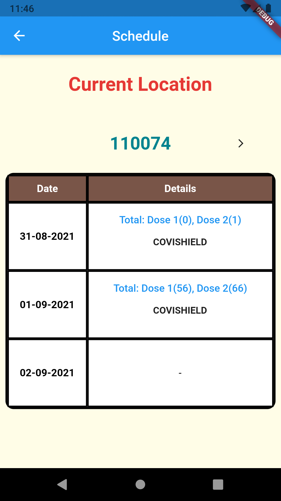 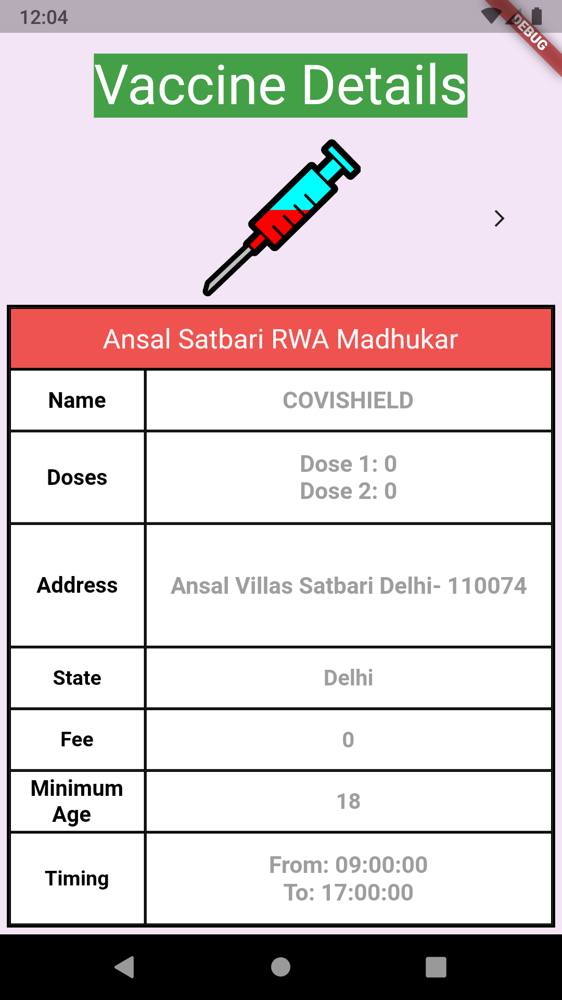

### Searching Vaccine availability via pincode
 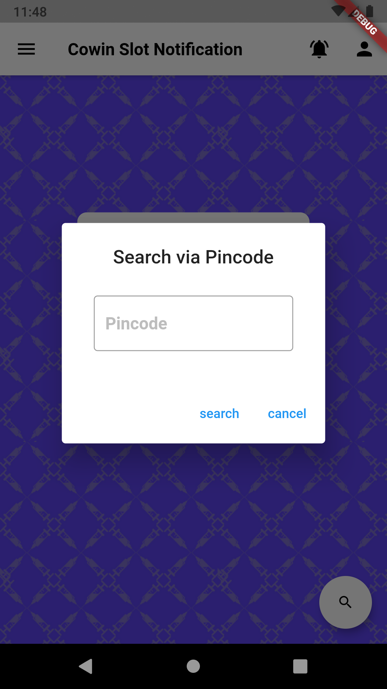

### Background Notifications
 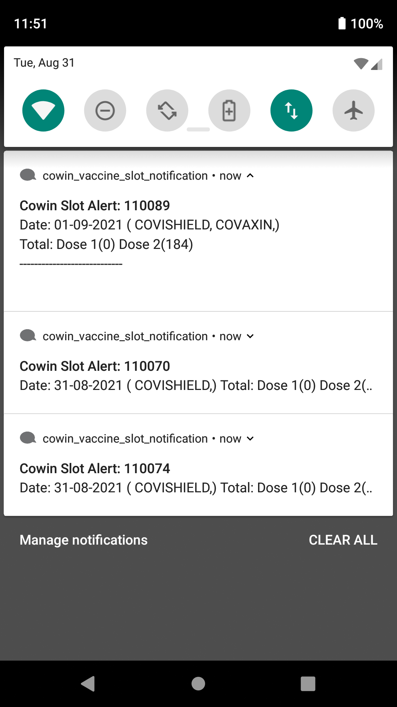 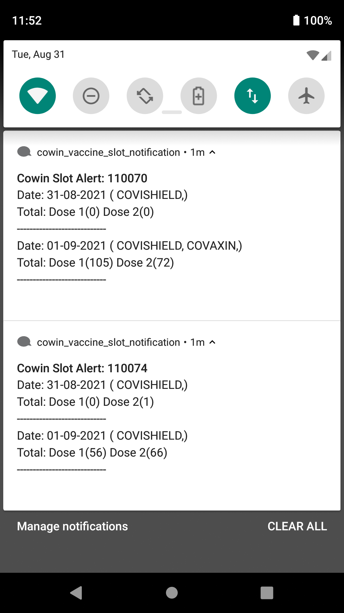

### AI predictions for future availability
 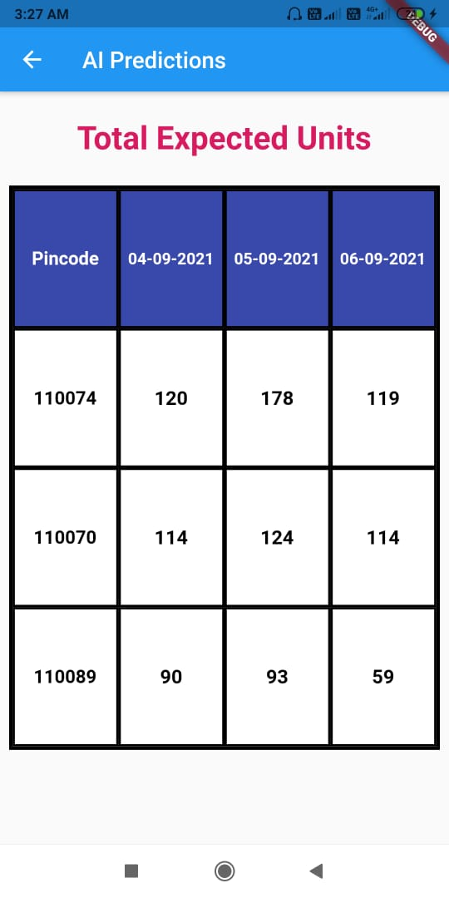

## Links
[apk_link]()

[ml_model_training_and_deployment](https://colab.research.google.com/drive/13N1RPtxWYZ9qUP7D-aZwMG12anWysoWb?usp=sharing)

[demo_videos](https://drive.google.com/drive/folders/1jjgnp6K0qRHLL1IKbJX-AzOjRr-v-dPr?usp=sharing)

### Team Members

